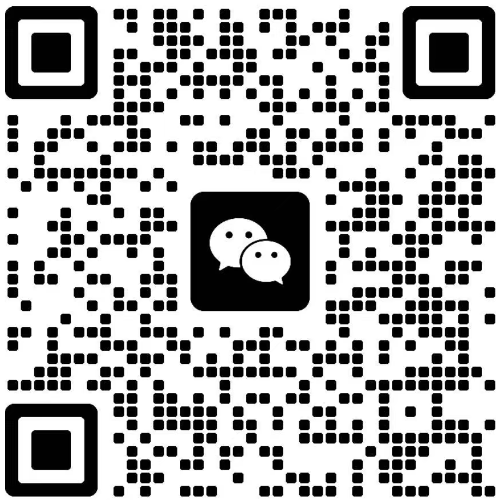

# 步骤三（Step3）优化改造 — 提示词（最终修订版 v2）

> 请根据以下需求，修改 `index.html`、`interactive-flow.js` 和 `script.js`。修改前请先通读全文，理解整体改动范围。

---

## ⚠️ 实现约束（动手前必读）

1. 步骤三从两个子页面（3.1+3.2）合并为一个页面。
2. 左侧第二条沟通重点是动态内容，必须使用下方提供的 `PAINPOINT_LABEL` 映射表，不要自行翻译。
3. 右侧联系方式从三个压缩到两个（微信扫码为主，电话预约为辅），有明确视觉主次。
4. 保留步骤四，但改造为极轻量的"完成确认页"。整体流程仍为4步。
5. 浮动CTA按钮不删除，改为在互动流程区域内自动隐藏。
6. `renderStep3()` 必须在每次从步骤二进入步骤三时重新执行（用户可能返回步骤二修改选择后再回来）。

---

## 一、改动概述

| 改动项 | 说明 |
|-------|------|
| `#step3` HTML | 整体替换，合并为左右两栏单页 |
| `#step4` HTML | 改造为轻量完成确认页 |
| `interactive-flow.js` | 新增 `renderStep3()`；删除 `initializeContactMethodOptions()`；修改导航逻辑 |
| `script.js` | 浮动CTA改为区域内隐藏（非删除） |
| CSS | 新增步骤三/四样式，删除旧样式 |

---

## 二、步骤三：标题替换

**当前：**
- badge：`🎯 预约确认`
- 大标题：`开启15分钟需求诊断`
- 副标题：`15分钟聚焦诊断，精准识别您企业AI落地的关键杠杆点与断点。`

**改为：**
- badge：`🎯 开始预约`
- 大标题：`开启15分钟精准诊断`
- 副标题：`帮您定位卡点、理清下一步该做什么（不推销，只给专业判断）`
- step-number 保持 `步骤 3/4`

---

## 三、步骤三：左侧内容（"价值说明"）

### 替换内容

小标题："这15分钟，您会得到："

三条沟通重点：

```
1. 帮您快速定位：您的企业在数据/AI的哪个阶段，离下一步还差什么
2. 聚焦您最关注的：围绕【动态内容】，给出初步判断和方向
3. 给出明确建议：接下来该做什么——是培训、咨询、还是先做某件具体的事
```

三条下方加一行小字（`0.85em`，浅灰色，加粗但不醒目）：
> **不推销，只给专业判断。**

### HTML 结构（含 class 名和 id）

```html
<div class="appointment-left">
    <h4 class="appointment-subtitle">这15分钟，您会得到：</h4>
    <div class="value-points">
        <div class="value-item">
            <span class="value-number">1</span>
            <div class="value-content">
                <strong>帮您快速定位：</strong>
                <span class="value-desc">您的企业在数据/AI的哪个阶段，离下一步还差什么</span>
            </div>
        </div>
        <div class="value-item">
            <span class="value-number">2</span>
            <div class="value-content">
                <strong>聚焦您最关注的：</strong>
                <span class="value-desc" id="focusPainPointText">围绕您企业当前最核心的落地瓶颈，给出初步判断和方向</span>
            </div>
        </div>
        <div class="value-item">
            <span class="value-number">3</span>
            <div class="value-content">
                <strong>给出明确建议：</strong>
                <span class="value-desc">接下来该做什么——是培训、咨询、还是先做某件具体的事</span>
            </div>
        </div>
    </div>
    <p class="appointment-promise-text">不推销，只给专业判断。</p>
</div>
```

### 第二条的动态渲染逻辑

**必须使用以下映射表（已在步骤二实现说明 v2 中定义，此处重复提供以确保可用）：**

```javascript
const PAINPOINT_LABEL = {
    'alignment': '高层认知拉不齐',
    'scenario':  '不知道从哪个场景切入',
    'scale':     '试点做了但规模化推不动',
    'roi':       '算不清投入产出',
    'roadmap':   '缺清晰的落地节奏',
    'team':      '团队能力跟不上'
};
```

**渲染函数：**

```javascript
function renderStep3() {
    const painPoints = flowState.selectedPainPoints;
    const el = document.getElementById('focusPainPointText');

    if (!painPoints || painPoints.length === 0) {
        // 后备文案：痛点为空时的兜底
        el.innerHTML = '围绕您企业当前最核心的落地瓶颈，给出初步判断和方向';
        return;
    }

    // 拼接规则：1个痛点用"A"，2个痛点用"A和B"（不用顿号）
    const painText = painPoints.map(p => `<strong>${PAINPOINT_LABEL[p]}</strong>`).join('和');
    el.innerHTML = `围绕${painText}，给出初步判断和方向`;
}
```

**调用时机：** 在 `initializeNavigationButtons()` 中，当 `data-next="step3"` 时，先调用 `renderStep3()` 再调用 `showStep(3)`：

```javascript
if (nextStep === 'step3') {
    renderStep3();
}
```

---

## 四、步骤三：右侧内容（"沟通方式选择"）

### 替换内容

小标题："选择您方便的沟通方式："

两个选项，有明确视觉主次。

### HTML 结构（含 class 名和 id）

```html
<div class="appointment-right">
    <h4 class="appointment-subtitle">选择您方便的沟通方式：</h4>

    <!-- 主选项：微信扫码（大卡片） -->
    <div class="contact-primary">
        <div class="qr-code-area">
            
        </div>
        <div class="contact-primary-info">
            <p class="contact-primary-title">扫码添加微信</p>
            <p class="contact-primary-desc">
                添加后备注<span class="highlight">"15分钟诊断"</span>（可选填写企业名），我们会在1个工作日内通过并约定时间。
            </p>
            <p class="wechat-id-row">
                微信号：<span class="copyable" id="wechatIdCopy">lihuaming-ai</span>
                <button class="copy-btn" aria-label="复制微信号">📋</button>
            </p>
        </div>
    </div>

    <!-- 次选项：预约电话（线框按钮） -->
    <div class="contact-secondary">
        <button class="btn btn-outline" id="bookPhoneBtn">
            <span>或预约电话时段</span>
        </button>
        <p class="contact-secondary-desc">选定时间，我们准时致电。</p>
    </div>
</div>
```

### 主选项样式要求
- 背景比页面底色稍亮（`rgba(255,255,255,0.05)`）
- **仅左侧**加一条 4px 金黄色高亮边框（`border-left: 4px solid #D4A843`），不要全包围边框
- 二维码图片居中，宽度约 180px
- 微信号旁的"复制"按钮：小图标，点击后复制微信号到剪贴板，显示"已复制"反馈（复用现有 `.copyable` 的逻辑）

### 次选项样式要求
- 线框按钮：`border: 1px solid rgba(255,255,255,0.3)`，hover 时边框变金黄色
- 视觉上明显小于主选项，让用户一眼看出"微信是主要方式"
- 按钮与主选项之间有适当间距

### 次选项点击行为
点击"预约电话时段"按钮后，弹出一个轻量表单弹窗（modal）：

```html
<div class="phone-booking-modal" id="phoneBookingModal" style="display:none;">
    <div class="modal-overlay"></div>
    <div class="modal-content">
        <h4>预约电话沟通</h4>
        <div class="form-group">
            <label>您的姓名</label>
            <input type="text" id="bookingName" placeholder="请输入姓名" />
        </div>
        <div class="form-group">
            <label>手机号码</label>
            <input type="tel" id="bookingPhone" placeholder="请输入手机号" />
        </div>
        <div class="form-group">
            <label>期望沟通时段</label>
            <select id="bookingTime">
                <option value="">请选择</option>
                <option value="weekday-morning">工作日上午 (9:00-12:00)</option>
                <option value="weekday-afternoon">工作日下午 (14:00-18:00)</option>
                <option value="weekend">周末 (灵活安排)</option>
            </select>
        </div>
        <div class="modal-actions">
            <button class="btn btn-secondary" id="modalCancel">取消</button>
            <button class="btn btn-gold" id="modalSubmit">提交预约</button>
        </div>
    </div>
</div>
```

提交行为：`console.log('预约信息:', { name, phone, time })` 并关闭弹窗，显示一句反馈"预约已提交，我们会尽快联系您"。后续再接真实系统。

弹窗事件绑定使用事件委托，避免重复绑定。

---

## 五、步骤三：底部内容

### 资料赠送提示
在沟通方式选择区域下方，居中展示：

```html
<div class="step3-bonus">
    <span class="bonus-icon">💡</span>
    <span class="bonus-text">沟通前我们会发送《AI落地断点自检表》，帮您提前梳理思路。</span>
</div>
```

样式：`0.9em`，图标+文字横排，居中。

### 安全承诺
在资料赠送下方，居中展示：

```html
<p class="step3-security">您的信息仅用于预约诊断，严格保密，绝不外泄。</p>
```

样式：`0.8em`，浅灰色 `rgba(255,255,255,0.4)`，居中。

### 操作按钮

```html
<div class="step-actions">
    <button class="btn btn-secondary btn-back" data-prev="step2">返回</button>
    <a href="javascript:void(0)" class="step3-complete-link" id="step3CompleteLink">我已扫码/预约完成 →</a>
</div>
```

- "返回"按钮：返回步骤二
- "我已扫码/预约完成 →"：文字链样式（非按钮），浅灰色，点击后跳转到步骤四（确认页）
- 文字链不要太醒目，它是给"已完成动作的用户"用的，不是主CTA

---

## 六、步骤四：改造为轻量完成确认页

**不删除步骤四**，改造为极轻量的"感谢+小贴士"页面，给用户明确的"流程结束感"。

### 用以下内容完整替换现有 `#step4` 内部 HTML：

```html
<div class="flow-step" id="step4" data-step="4">
    <div class="step-header">
        <span class="step-badge">✅ 预约完成</span>
        <span class="step-number">步骤 4/4</span>
        <h3 class="step-title">期待与您深度交流</h3>
        <p class="step-subtitle">您的专属诊断时间已锁定。在沟通前，建议您简单梳理以下信息，确保15分钟高效利用：</p>
    </div>

    <div class="completion-tips">
        <div class="tip-item">
            <span class="tip-icon">✓</span>
            <div class="tip-content">
                <strong>明确业务挑战：</strong>
                <span>您目前最核心的经营挑战是什么（如增长/合规/降本）</span>
            </div>
        </div>
        <div class="tip-item">
            <span class="tip-icon">✓</span>
            <div class="tip-content">
                <strong>提前了解数据现状：</strong>
                <span>企业有哪些系统和数据源，治理程度如何</span>
            </div>
        </div>
        <div class="tip-item">
            <span class="tip-icon">✓</span>
            <div class="tip-content">
                <strong>核心决策者：</strong>
                <span>谁会参与决策（CEO/CIO/业务负责人等）</span>
            </div>
        </div>
    </div>

    <div class="completion-promise">
        <div class="promise-badges">
            <span class="promise-badge">绝无销售压力</span>
            <span class="promise-badge">只提供专业建议</span>
            <span class="promise-badge">信息严格保密</span>
        </div>
    </div>

    <div class="step-actions">
        <button class="btn btn-secondary btn-back" data-prev="step3">返回上一步</button>
    </div>
</div>
```

### 步骤四样式要求
- 整体居中，内容紧凑，不需要左右分栏
- tip-item 使用与步骤三 value-item 相同的视觉风格（序号圆点 + 文字）
- promise-badges 使用描边样式（与现有设计一致）
- 无"继续"按钮——这是流程终点
- 整体氛围要"轻松、专业、终结感"，不要再制造紧迫感

---

## 七、浮动CTA按钮：改为区域内隐藏（非删除）

**不要删除** `#floatingCta` 元素和相关代码。改为：当用户滚动到互动流程区域（`#interactive`）时自动隐藏，离开后恢复显示。

**修改 `script.js` 中的滚动监听：**

```javascript
window.addEventListener('scroll', () => {
    const scrollPosition = window.scrollY;

    // Header 滚动效果（保持不变）
    if (scrollPosition > 100) {
        header.classList.add('scrolled');
    } else {
        header.classList.remove('scrolled');
    }

    // 浮动CTA：在互动流程区域内隐藏
    const interactiveSection = document.getElementById('interactive');
    if (interactiveSection) {
        const interactiveTop = interactiveSection.offsetTop;
        const interactiveBottom = interactiveTop + interactiveSection.offsetHeight;
        const heroHeight = document.querySelector('.hero').offsetHeight;

        if (scrollPosition > heroHeight - 200 && (scrollPosition < interactiveTop || scrollPosition > interactiveBottom)) {
            floatingCta.classList.add('visible');
        } else {
            floatingCta.classList.remove('visible');
        }
    }
});
```

---

## 八、需要删除的旧代码清单

### interactive-flow.js：
- `initializeContactMethodOptions` — 整个函数删除
- `initializeInteractiveFlow()` 中对 `initializeContactMethodOptions()` 的调用 — 删除该行
- `selectedContactMethod` — flowState 中的字段定义和所有赋值语句

### index.html `#step3` 内删除：
- `.contact-method-options` 整个区块
- `.contact-method-grid` 及其三个子卡片
- `.preview-resources` 区块（"沟通前您可以先浏览"）
- `.next-steps` 区块（"接下来只需三步"）
- 旧的 `.appointment-left` 和 `.appointment-right` 内容（用新模板替换）

### index.html `#step4` 内删除：
- 旧的 `.qr-code-section` 区块（二维码已移到步骤三）
- 旧的 `.communication-tips` 区块（小贴士已重写）
- 旧的 `.professional-promise` 区块（承诺已重写）
- 旧的 `.promise-message` 段落

### CSS 中删除：
- `.contact-method-options` 相关样式
- `.contact-method-grid` 相关样式
- `.contact-method-card` 相关样式

---

## 九、样式要求汇总

### 左侧沟通重点（.value-item）
- `.value-number`：金黄色圆形背景 `#D4A843`，白色数字，宽高 28px，居中
- `strong` 标题：白色
- `.value-desc`：浅灰色 `rgba(255,255,255,0.7)`
- `.appointment-promise-text`：`0.85em`，浅灰色，`font-weight: 600`，`margin-top: 16px`

### 右侧主选项（.contact-primary）
- 背景：`rgba(255,255,255,0.05)`
- 仅左侧加 4px 金黄色高亮边框（`border-left: 4px solid #D4A843`），不要全包围
- 二维码图片宽度约 180px，居中
- 圆角 `8px`，内边距 `24px`

### 右侧次选项（.contact-secondary）
- `.btn-outline`：`border: 1px solid rgba(255,255,255,0.3)`，背景透明，hover 时边框变 `#D4A843`
- 视觉上明显小于主选项

### 底部提示
- `.step3-bonus`：居中，`0.9em`
- `.step3-security`：居中，`0.8em`，`rgba(255,255,255,0.4)`

### "我已完成"文字链
- `.step3-complete-link`：`0.9em`，浅灰色 `rgba(255,255,255,0.5)`，hover 时变金黄色，无下划线
- 不要太醒目，服务于"已完成动作的用户"

### 电话预约弹窗（.phone-booking-modal）
- 居中弹窗，宽度 `400px`，深色背景与站点一致
- overlay 半透明黑色
- 输入框和下拉框使用深色背景 + 浅色边框，与站点风格统一
- 关闭/取消时平滑过渡（`opacity 0.3s`）

### 整体布局
- 左右两栏：左 45%，右 55%
- **移动端（<768px）**：上下堆叠，左侧在上右侧在下
- 移动端时左侧字号适当缩小、行高紧凑，确保右侧二维码在首屏或轻微滑动即可见
